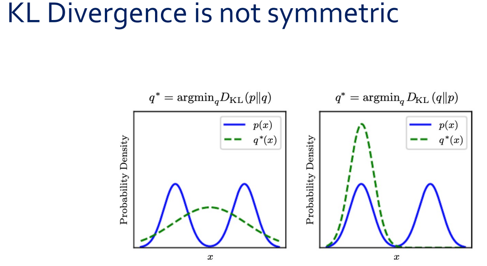

## 개요

딥러닝을 이해하기 위해서는 세 가지 수학적 기초가 필수적이다.

- **확률론 (Probability Theory)**: 데이터와 모델의 불확실성을 다루는 언어
- **정보이론 (Information Theory)**: 확률 분포 간의 차이를 정량화하는 도구
- **수치 최적화 (Numerical Optimization)**: 모델 파라미터를 학습하는 메커니즘

이 세 기둥 위에 과적합(overfitting)이라는 핵심 도전이 놓여 있으며, 이를 극복하는 것이 딥러닝 연구의 중심 과제이다.

---

# 확률론 (Probability Theory)

## 확률변수 (Random Variable)

확률변수를 이해하는 데에는 두 가지 수준이 있다.

**쉬운 정의**: 다양한 값을 랜덤하게 취할 수 있는 변수이다. 예를 들어, 주사위를 던지면 결과값 $X$는 $\{1,2,3,4,5,6\}$ 중 하나를 취한다.

**엄밀한 정의**: 확률변수는 표본 공간(sample space) $\Omega$의 원소를 가측 공간(measurable space), 보통 실수 $\mathbb{R}$로 대응시키는 **함수(mapping)**이다.

$$\text{Real world event} \xrightarrow{\text{Random variable}} \text{Probability (a measurable value)}$$

::: {.callout-tip title="무선통신에서의 비유"}
채널의 상태를 나타내는 CSI(Channel State Information) $\mathbf{h}$가 바로 확률변수이다. 채널 환경이라는 "real world event"를 복소수 벡터라는 "measurable value"로 매핑하는 것이다.
:::

확률변수는 **이산(discrete)** 또는 **연속(continuous)**으로 나뉘며, 각각을 기술하는 함수가 다르다.

## 이산 확률변수의 확률 분포 — PMF

이산 확률변수는 **확률질량함수(Probability Mass Function, PMF)** $P(x)$로 기술된다. 대표적 예시로 Bernoulli 분포가 있다(동전 던지기와 같은 $\{0, 1\}$ 결과).

PMF는 세 가지 공리를 만족해야 한다.

1. $P(\cdot)$의 정의역은 $x$의 모든 가능한 상태의 집합이어야 한다.
2. $\forall x \in \mathbf{x},\; 0 \le P(x) \le 1$
3. $\sum_{x \in \mathbf{x}} P(x) = 1$ (정규화 조건)

## 연속 확률변수의 확률 분포 — PDF

연속 확률변수는 **확률밀도함수(Probability Density Function, PDF)** $p(x)$로 기술된다. Gaussian(정규) 분포가 대표적이며, $\mu$는 평균, $\sigma^2$는 분산을 나타낸다.

연속 r.v.의 세 가지 공리:

1. $p(\cdot)$의 정의역은 $x$의 모든 가능한 상태의 집합이어야 한다.
2. $\forall x \in \mathbf{x},\; 0 \le p(x)$ — 단, **$p(x) \le 1$일 필요는 없다!**
3. $\int p(x)\,dx = 1$

::: {.callout-important title="PMF와 PDF의 핵심 차이"}
PMF에서는 $P(x) \le 1$이지만, PDF에서는 $p(x)$가 1보다 클 수 있다. 예를 들어, $\sigma^2 = 0.2$인 Gaussian의 경우 $p(0) \approx 0.89$이고, 분산이 더 작아지면 peak이 1을 넘는다. 이것은 PDF에서 확률이 $p(x)$의 값 자체가 아니라 **적분 $\int_a^b p(x)\,dx$**로 정의되기 때문이다.
:::

**Measure zero** 개념도 중요하다. 연속 분포에서 특정 한 점의 확률은 $P(\mathbf{x} = x) = 0$이다. 그럼에도 불구하고 전체를 적분하면 1이 된다. 이것이 measure theory에서 말하는 "거의 모든 곳에서 0이지만 적분하면 1"인 성질이다.

::: {.callout-tip title="무선통신에서의 비유"}
AWGN 채널 노이즈 $n \sim \mathcal{N}(0, \sigma^2)$의 PDF가 바로 Gaussian PDF이다. 분산 $\sigma^2$이 작을수록(SNR이 높을수록) PDF가 뾰족해져서 peak이 높아지지만, 적분은 여전히 1이다.
:::

## 결합 확률 분포 (Joint Probability Distribution)

두 확률변수 $\mathbf{x}$와 $\mathbf{y}$가 동시에 특정 값을 가질 확률이다.

$$P(\mathbf{x} = x, \mathbf{y} = y)$$

간단히 $P(x, y)$로도 쓴다. 결합 확률에서 변수들의 **순서는 중요하지 않다**. $P(A, B, C) = P(B, A, C) = P(C, A, B)$이다. "동시에 일어날 확률"이라는 직관이 정확하다.

::: {.callout-tip title="무선통신에서의 비유"}
송신 신호 $x$와 수신 신호 $y$의 결합 분포가 채널 모델 전체를 기술한다.
:::

## 주변 확률 (Marginal Probability)

결합 분포에서 하나의 변수를 "소거(sum out)"하여 나머지 변수만의 분포를 얻는 과정이다.

- **이산**: $P(\mathbf{x} = x) = \displaystyle\sum_{y} P(\mathbf{x} = x, \mathbf{y} = y)$
- **연속**: $p(x) = \displaystyle\int p(x, y)\,dy$

이 과정을 **주변화(marginalization)**라고 부른다.

## 조건부 확률 (Conditional Probability)

$$P(\mathbf{y} = y \mid \mathbf{x} = x) = \frac{P(\mathbf{y} = y, \mathbf{x} = x)}{P(\mathbf{x} = x)}$$

여기서 $\mathbf{x}$는 **conditioning variable(조건변수)**, $\mathbf{y}$는 **conditioned variable(피조건변수)**이다.

::: {.callout-note title="P(y=y|x=x)는 어떤 변수의 함수인가?"}
$P(\mathbf{y} = y \mid \mathbf{x} = x)$는 엄밀히 말하면 **$x$와 $y$ 둘 다의 함수**이다. 다만, 조건부 확률의 본질적 특징을 부각하기 위해 "$x$의 함수"라고 강조하는 경우가 많다. 일반적인 $P(\mathbf{y} = y)$는 $y$만의 함수인데, 조건부가 붙으면 $x$가 바뀔 때마다 $y$에 대한 분포 전체가 달라진다는 점이 새롭기 때문이다. $y$가 변수라는 것은 당연하므로 따로 강조하지 않는 것이다.

구체적으로 구분하면 다음과 같다.

- $y$를 고정하고 $x$를 변화시키면 → **likelihood function** $\mathcal{L}(x) = P(\mathbf{y}=y_0 \mid \mathbf{x}=x)$: "관측값 $y_0$이 고정된 상태에서, 어떤 $x$가 이 관측을 잘 설명하는가?"
- $x$를 고정하고 $y$를 변화시키면 → **조건부 분포** $P(\mathbf{y}=y \mid \mathbf{x}=x_0)$: "$x_0$라는 조건 하에서 $y$의 확률 분포가 어떤 모양인가?"

무선통신으로 비유하면, 채널 모델 $p(y \mid x) = \frac{1}{\sqrt{2\pi\sigma^2}} \exp\left(-\frac{(y - hx)^2}{2\sigma^2}\right)$에서 송신 신호 $x$를 고정하면 수신 신호 $y$에 대한 Gaussian 분포가 되고, 수신 신호 $y$를 고정하면 어떤 $x$를 보냈을 때 이 $y$가 관측될 가능성이 높은지를 나타내는 likelihood가 된다. 같은 함수를 어떤 변수의 관점에서 보느냐에 따라 해석이 달라진다.
:::

## 조건부 확률의 연쇄 법칙 (Chain Rule) {#sec-chain-rule}

### 기본 형태: 2개 변수

조건부 확률의 정의로부터:

$$P(\mathbf{y} = y \mid \mathbf{x} = x) = \frac{P(\mathbf{x} = x, \mathbf{y} = y)}{P(\mathbf{x} = x)}$$

양변에 $P(\mathbf{x} = x)$를 곱하면:

$$P(\mathbf{x}, \mathbf{y}) = P(\mathbf{y} \mid \mathbf{x}) \cdot P(\mathbf{x})$$

이것이 chain rule의 가장 기본 형태이다. **"joint = conditional × marginal"**이다.

### 3개 변수로의 확장

$P(\mathbf{a}, \mathbf{b}, \mathbf{c})$를 분해해 보자. $(\mathbf{a})$와 $(\mathbf{b}, \mathbf{c})$를 하나의 덩어리로 보고 2개짜리 규칙을 적용한다:

$$P(\mathbf{a}, \mathbf{b}, \mathbf{c}) = P(\mathbf{a} \mid \mathbf{b}, \mathbf{c}) \cdot P(\mathbf{b}, \mathbf{c})$$

이제 $P(\mathbf{b}, \mathbf{c})$에 다시 2개짜리 규칙을 적용한다:

$$P(\mathbf{b}, \mathbf{c}) = P(\mathbf{b} \mid \mathbf{c}) \cdot P(\mathbf{c})$$

합치면:

$$\boxed{P(\mathbf{a}, \mathbf{b}, \mathbf{c}) = P(\mathbf{a} \mid \mathbf{b}, \mathbf{c}) \cdot P(\mathbf{b} \mid \mathbf{c}) \cdot P(\mathbf{c})}$$

### $n$개 변수의 일반화

같은 "껍질 벗기기"를 반복하면:

$$P(\mathbf{x}^{(1)}, \ldots, \mathbf{x}^{(n)}) = P(\mathbf{x}^{(1)}) \prod_{i=2}^{n} P(\mathbf{x}^{(i)} \mid \mathbf{x}^{(1)}, \ldots, \mathbf{x}^{(i-1)})$$

이것을 **chain rule** 또는 **product rule**이라 한다.

::: {.callout-note title="일반화 공식의 유도 과정"}
$P(\mathbf{x}^{(1)}, \ldots, \mathbf{x}^{(n)})$에서 $\mathbf{x}^{(1)}$을 먼저 떼어내면:

$$= P(\mathbf{x}^{(1)} \mid \mathbf{x}^{(2)}, \ldots, \mathbf{x}^{(n)}) \cdot P(\mathbf{x}^{(2)}, \ldots, \mathbf{x}^{(n)})$$

$P(\mathbf{x}^{(2)}, \ldots, \mathbf{x}^{(n)})$에서 $\mathbf{x}^{(2)}$를 떼어내면:

$$= P(\mathbf{x}^{(1)} \mid \mathbf{x}^{(2)}, \ldots, \mathbf{x}^{(n)}) \cdot P(\mathbf{x}^{(2)} \mid \mathbf{x}^{(3)}, \ldots, \mathbf{x}^{(n)}) \cdot P(\mathbf{x}^{(3)}, \ldots, \mathbf{x}^{(n)})$$

이것을 마지막 $P(\mathbf{x}^{(n)})$만 남을 때까지 반복하면 최종 공식이 된다. 어떤 방향에서 분해를 시작하든(위의 방식은 $\mathbf{x}^{(n)}$을 마지막 marginal로 남기는 방향, 공식의 형태는 $\mathbf{x}^{(1)}$을 첫 marginal로 두는 방향) 결과값은 동일하다.
:::

::: {.callout-note title="직관적 해석"}
"$\mathbf{a}$, $\mathbf{b}$, $\mathbf{c}$가 동시에 일어날 확률"을 **순차적 의사결정**으로 바꿔 생각하면 된다:

> 먼저 $\mathbf{c}$가 일어나고 → 그 다음 $\mathbf{c}$가 주어진 상태에서 $\mathbf{b}$가 일어나고 → 마지막으로 $\mathbf{b}, \mathbf{c}$가 모두 주어진 상태에서 $\mathbf{a}$가 일어난다.

joint probability의 순서는 상관없지만, chain rule로 분해할 때의 **조건 부여 순서**에 따라 식의 형태가 달라진다. 이 선택이 모델링에서 중요한 설계 결정이 된다.
:::

::: {.callout-tip title="딥러닝 연결: Autoregressive Model"}
GPT 같은 autoregressive 모델이 시퀀스를 생성할 때 바로 이 chain rule을 활용한다.

$$P(w_1, w_2, \ldots, w_n) = P(w_1) P(w_2|w_1) P(w_3|w_1, w_2) \cdots$$

토큰을 순차적으로 생성하는 것이 chain rule의 직접적 응용이다.
:::

## 독립과 조건부 독립 (Independence & Conditional Independence)

### 독립 (Independence)

$\mathbf{x}$와 $\mathbf{y}$가 독립이면, 결합 분포가 주변 분포의 곱으로 분해된다:

$$p(\mathbf{x} = x, \mathbf{y} = y) = p(\mathbf{x} = x)p(\mathbf{y} = y)$$

### 조건부 독립 (Conditional Independence)

$\mathbf{z}$가 주어졌을 때 $\mathbf{x}$와 $\mathbf{y}$가 조건부 독립이면:

$$p(\mathbf{x} = x, \mathbf{y} = y \mid \mathbf{z} = z) = p(\mathbf{x} = x \mid \mathbf{z} = z)p(\mathbf{y} = y \mid \mathbf{z} = z)$$

::: {.callout-warning title="독립과 조건부 독립은 서로를 함의하지 않는다"}
독립인 두 변수가 공통 결과가 관측되면 조건부 종속이 될 수 있고(explaining away), 반대로 종속인 두 변수가 어떤 변수가 주어지면 조건부 독립이 될 수도 있다.
:::

### Explaining Away 현상 {#sec-explaining-away}

Explaining away는 **조건부 종속**의 대표적 예이다. 핵심은: **독립인 두 변수가, 공통 결과가 관측되면 조건부 종속이 된다**는 것이다.

무선통신에서의 예시를 들어보자. 수신 신호가 갑자기 약해졌다고 하자($Y = \text{weak}$). 원인은 두 가지가 가능하다:

- (A) 송신기 고장
- (B) 건물에 의한 shadowing

A와 B는 물리적으로 독립인 사건이므로 $P(A, B) = P(A)P(B)$이다.

그런데 $Y = \text{weak}$을 **관측한 후**에는 상황이 달라진다. 만약 누군가 "건물 shadowing 때문이었어"라고 확인해주면($B = \text{true}$), "그러면 송신기 고장일 확률은 낮겠네"라고 추론하게 된다. 즉:

$$P(A \mid Y, B = \text{true}) < P(A \mid Y)$$

한 원인이 결과를 **설명해버리면(explain away)** 다른 원인의 확률이 줄어든다. 수식으로는:

$$P(A, B \mid Y) \neq P(A \mid Y) P(B \mid Y)$$

$A$와 $B$는 원래 독립이었지만, 공통 결과 $Y$가 관측되자 **조건부 종속**이 되었다.

반대 방향의 예도 있다. 같은 기지국의 두 사용자의 throughput은 종속이지만(같은 기지국 부하를 공유), 기지국 부하량 $Z$가 주어지면 조건부 독립이 될 수 있다.

## 기댓값 (Expectation)

확률변수의 "가장 가능성 있는 발생 값(most likely occurring value)"을 나타내는 연산자이다.

- **이산**: $\mathbb{E}_{\mathbf{x} \sim P}[f(x)] = \displaystyle\sum_x P(x)f(x)$
- **연속**: $\mathbb{E}_{\mathbf{x} \sim p}[f(x)] = \displaystyle\int p(x)f(x)\,dx$

핵심 성질로 **기댓값은 선형 연산자**이다:

$$\mathbb{E}_{\mathbf{x}}[\alpha f(x) + \beta g(x)] = \alpha \mathbb{E}_{\mathbf{x}}[f(x)] + \beta \mathbb{E}_{\mathbf{x}}[g(x)]$$

## 디랙 델타 함수 (Dirac Delta Function) {#sec-dirac-delta}

원점을 제외한 모든 곳에서 0이지만, 적분하면 1이 되는 "함수"(엄밀히는 분포, distribution)이다.

### 적분이 1인 이유

엄밀히 말하면 Dirac delta는 보통의 함수가 아니다. "모든 곳에서 0인데 적분하면 1"인 함수는 고전적 의미에서는 존재하지 않는다. Dirac delta는 **일반화된 함수(generalized function)**로, 다른 함수에 작용하는 연산자로서 정의된다:

$$\int_{-\infty}^{\infty} \delta(x) f(x)\,dx = f(0)$$

이것이 Dirac delta의 **정의**이다. $f(x) = 1$을 넣으면 $\int \delta(x)\,dx = 1$이 된다. 적분이 1인 것은 증명이 아니라 **정의에서 나오는 것**이다.

::: {.callout-note title="직관적 이해: 극한 과정으로서의 Dirac delta"}
분산이 점점 줄어드는 Gaussian을 상상해 보자:

$$\delta(x) = \lim_{\sigma \to 0} \frac{1}{\sqrt{2\pi\sigma^2}} \exp\left(-\frac{x^2}{2\sigma^2}\right)$$

$\sigma$가 아무리 작아져도 Gaussian의 적분은 항상 1이다. 봉우리가 무한히 높아지고 폭이 무한히 좁아지지만, **넓이(적분)는 항상 보존**된다. 이 극한이 Dirac delta이다.
:::

### 경험적 분포 (Empirical Distribution)

연속 확률변수의 경험적 분포를 만들 때 Dirac delta가 사용된다:

$$\hat{p}(\mathbf{x}) = \frac{1}{m} \sum_{i=1}^{m} \delta(\mathbf{x} - \mathbf{x}^{(i)})$$

$m$개의 관측 데이터에 동일한 가중치 $1/m$을 부여하여 연속 r.v.를 이산적으로 표현하는 방법이다. 이 경험적 분포 개념이 Maximum Likelihood Estimation(MLE)의 출발점이 된다.

## 혼합 분포 (Mixture of Distributions) {#sec-mixture}

$$P(\mathbf{x}) = \sum_i P(\mathbf{c} = i) P(\mathbf{x} \mid \mathbf{c} = i)$$

여기서 $P(\mathbf{c})$는 multinoulli 분포(어떤 component를 선택할지), $\mathbf{c}$는 **잠재 변수(latent variable)**이다. 가장 대표적인 혼합 분포가 **Gaussian Mixture Model(GMM)**으로, 각 component $P(\mathbf{x} \mid \mathbf{c} = i)$가 Gaussian이다.

GMM은 **밀도 함수의 보편적 근사기(universal approximator of densities)**로 불린다. 충분한 수의 Gaussian component를 사용하면 임의의 연속 밀도를 원하는 정밀도로 근사할 수 있다.

### 왜 $c$를 "latent variable"이라 부르는가?

실제로 관측하는 것은 $\mathbf{x}$뿐이다. $\mathbf{c}$는 "이 데이터 포인트가 어떤 component에서 왔는가"를 나타내는 변수인데, **직접 관측할 수 없다**. "Latent"는 라틴어로 "숨어있는(hidden)"이라는 뜻이며, 관측 불가능하지만 데이터 생성 과정을 설명하는 데 필요한 변수를 지칭한다.

::: {.callout-tip title="무선통신에서의 비유"}
도시의 여러 기지국에서 수집한 수신 신호 세기(RSSI) 데이터가 있다고 하자. 전체 분포를 보면 여러 봉우리가 있는 복잡한 형태이다. 사실 각 봉우리는 서로 다른 기지국에 가까운 측정점에서 나온 것인데, 데이터에는 "어떤 기지국에서 온 데이터인지"가 기록되어 있지 않다. 이 "어떤 기지국인가"가 바로 latent variable $\mathbf{c}$이다.

- $P(\mathbf{c} = i)$: $i$번째 기지국 근처에서 측정할 확률
- $P(\mathbf{x} \mid \mathbf{c} = i)$: $i$번째 기지국 근처에서의 RSSI 분포
:::

### 딥러닝에서의 중요성

Mixture of distributions의 아이디어는 딥러닝 핵심 생성 모델들의 근간이다.

**VAE(Variational Autoencoder)**: $\mathbf{c}$가 이산이 아니라 연속적인 latent vector $\mathbf{z}$로 확장된다.

$$P(\mathbf{x}) = \int P(\mathbf{x} \mid \mathbf{z}) P(\mathbf{z})\,d\mathbf{z}$$

무한히 많은 component의 연속적 혼합이다.

**GAN**: 랜덤 노이즈 $\mathbf{z}$를 generator에 통과시켜 $\mathbf{x} = G(\mathbf{z})$를 만드는 것도, $\mathbf{z}$라는 latent variable로부터 복잡한 데이터 분포를 생성하는 mixture의 일반화이다.

**Softmax 출력**: 분류 모델이 $P(\mathbf{c} = i \mid \mathbf{x})$를 출력하는 것은, Bayes' rule을 통해 mixture의 역문제를 푸는 것이다. "이 데이터 $\mathbf{x}$가 어떤 component에서 왔을 확률이 가장 높은가?"

## 베이즈 정리 (Bayes' Rule)

$$P(\mathbf{x} \mid \mathbf{y}) = \frac{P(\mathbf{x})P(\mathbf{y} \mid \mathbf{x})}{P(\mathbf{y})}$$

조건부 확률에서 $\mathbf{x}$와 $\mathbf{y}$의 역할을 바꿔주는 공식이다. 각 항의 이름은 다음과 같다.

| 항 | 이름 | 의미 |
|---|---|---|
| $P(\mathbf{x})$ | **Prior (사전 확률)** | 관측 이전의 $\mathbf{x}$에 대한 믿음 |
| $P(\mathbf{y} \mid \mathbf{x})$ | **Likelihood (가능도)** | $\mathbf{x}$ 하에서 $\mathbf{y}$가 관측될 가능성 |
| $P(\mathbf{x} \mid \mathbf{y})$ | **Posterior (사후 확률)** | 관측 이후의 $\mathbf{x}$에 대한 업데이트된 믿음 |
| $P(\mathbf{y})$ | **Evidence (증거)** | 관측 $\mathbf{y}$의 전체 확률 (정규화 상수) |

: Bayes' Rule 각 항의 이름과 의미 {.striped}

::: {.callout-tip title="무선통신에서의 비유"}
MAP(Maximum a Posteriori) 검출기가 바로 이 Bayes' rule을 사용한다. 수신 신호 $\mathbf{y}$를 관측한 후, 송신 신호 $\mathbf{x}$의 사후 확률을 최대화한다:

$$\hat{\mathbf{x}} = \arg\max_{\mathbf{x}} P(\mathbf{x} \mid \mathbf{y})$$
:::

---

# 정보이론 (Information Theory)

## 정보이론의 기원

정보이론은 Shannon이 **잡음이 있는 채널에서 이산 알파벳 메시지를 전송**하는 문제를 연구하며 1948년에 탄생했다.

## 자기 정보량 (Self-Information) {#sec-self-info}

$$I(x) = -\log P(x)$$

단위는 **nat** (자연로그 사용 시)이다.

### 직관적 이해: "놀라움의 정도(Surprise)"

자기 정보량을 **놀라움의 정도**로 생각하면 직관이 선명해진다.

내일 해가 뜰 확률은 거의 1이다. 누군가 "내일 해가 뜬대!"라고 말하면 어떤 반응인가? "그래서?" — 전혀 놀랍지 않고, 새로운 정보가 없다. $P \approx 1$이므로 $I = -\log(1) = 0$이다.

반면 "내일 서울에 눈이 3미터 온대!"라고 하면? 극도로 놀랍고, 이 정보를 들은 후 행동이 크게 바뀐다(약속 취소, 대비 등). $P \approx 0$이므로 $I = -\log(\epsilon) \to \infty$이다.

::: {.callout-important title="정보이론의 핵심 통찰"}
**정보의 가치 = 그것을 듣기 전과 후의 믿음(belief)의 변화량.** 확실한 사건을 전해들어도 믿음이 안 바뀌니까 정보가 없고, 불확실한 사건의 결과를 전해들으면 믿음이 크게 바뀌니까 정보량이 크다.
:::

### 왜 하필 $\log$인가?

**이유 1: 독립 사건의 가산성.** 독립 사건의 정보량은 더해져야(additive) 한다. 독립이면 $P(x_1, x_2) = P(x_1)P(x_2)$인데, 이 곱을 합으로 바꿔주는 함수가 바로 $\log$이다:

$$-\log(P(x_1)P(x_2)) = -\log P(x_1) - \log P(x_2) = I(x_1) + I(x_2)$$

**이유 2: 통신에서의 기원.** $n$개의 동일 확률 메시지 중 하나를 전송하려면 $\log_2 n$ 비트가 필요하다. 각 메시지의 확률이 $1/n$이므로 $-\log_2(1/n) = \log_2 n$이다.

## Shannon 엔트로피 (Shannon Entropy) {#sec-entropy}

자기 정보량의 기댓값이 **Shannon 엔트로피**이다:

$$H(\mathbf{x}) = \mathbb{E}_{\mathbf{x} \sim P}[I(x)] = -\mathbb{E}_{\mathbf{x} \sim P}[\log P(x)]$$

엔트로피는 확률 분포가 담고 있는 **불확실성(uncertainty)**의 양을 측정한다.

$\mathbf{x}$가 연속 확률변수인 경우 이를 **미분 엔트로피(differential entropy)**라고 한다. 연속 엔트로피는 이산 엔트로피와 달리 음수가 될 수 있다는 점에 주의해야 한다.

### Bernoulli 변수에서 $p = 0.5$일 때 엔트로피가 최대인 이유

::: {.callout-warning title="자기 정보량과 엔트로피의 혼동에 주의"}
자기 정보량 $I(x) = -\log P(x)$는 특정 사건 **하나**의 정보량으로, $P(x)$가 커지면 **단조감소**한다. 이것은 맞다.

그러나 엔트로피는 자기 정보량의 **기댓값**이다:

$$H = -\sum_x P(x) \log P(x)$$

이것은 $I(x)$에 $P(x)$를 **가중평균**한 것이므로 단조감소가 아니다.
:::

Bernoulli($p$) 변수에서 $\mathbf{x} \in \{0, 1\}$이므로:

$$H = -p \log p - (1-p) \log(1-p)$$

항이 **두 개**라는 것이 핵심이다. $p$를 키우면 첫째 항에서 $\log p$의 크기는 줄어들지만 가중치 $p$는 커지고, 동시에 둘째 항에서 $(1-p)$은 줄어들지만 $\log(1-p)$의 크기는 커진다. 이 두 효과가 경쟁하는 구조이다.

구체적으로 계산하면:

| $p$ | $H$ |
|-----|-----|
| 0.1 | $\approx 0.33$ |
| 0.5 | $\approx 0.69$ (최대) |
| 0.9 | $\approx 0.33$ |

: Bernoulli 변수의 확률에 따른 엔트로피 값 {.striped}

$p = 0.5$에서 최대가 되는 이유는, 이 지점에서 **두 사건 모두 "적당히 놀라운" 상태**이기 때문이다. $p = 0.99$이면 $x = 1$은 거의 확실(놀라움 없음)하고, $x = 0$은 매우 놀랍지만 거의 발생하지 않으므로 **평균적 놀라움**은 작다. 양쪽 사건이 동등하게 불확실할 때 평균 놀라움이 극대화된다.

## KL Divergence (Kullback-Leibler 발산) {#sec-kl-divergence}

$$D_{KL}(p \| q) = \sum_x p(x)(\log p(x) - \log q(x))$$

두 확률 분포 $p$와 $q$ 사이의 **"거리 비슷한 것(kind of distance)"**이지만, 진정한 거리(metric)는 아니다.

### Metric의 4가지 공리와 KL Divergence

거리 함수(metric) $d(x, y)$가 되려면 네 가지 공리를 만족해야 한다:

| 공리 | 수식 | KL divergence 만족 여부 |
|------|------|------|
| 비음성 | $d(x, y) \ge 0$ | **만족** |
| 식별 불가능자의 동일성 | $d(x, y) = 0 \leftrightarrow x = y$ | **만족** |
| 대칭성 | $d(x, y) = d(y, x)$ | **불만족** |
| 삼각부등식 | $d(x, z) \le d(x, y) + d(y, z)$ | **불만족** |

: KL Divergence의 metric 공리 만족 여부 {.striped}

::: {.callout-important title="KL Divergence는 삼각부등식도 만족하지 않는다"}
대칭성뿐 아니라 삼각부등식도 깨진다. 구체적 반례로, 세 Bernoulli 분포 $p = (0.1, 0.9)$, $q = (0.5, 0.5)$, $r = (0.9, 0.1)$을 생각하면:

$$D_{KL}(p \| r) \approx 1.76 > D_{KL}(p \| q) + D_{KL}(q \| r) \approx 0.51 + 0.51 = 1.02$$

따라서 KL divergence는 metric 공리 4개 중 2개만 만족하므로, "divergence"라고 부르지 "distance"라고 부르지 않는다. 반면, Jensen-Shannon divergence의 제곱근 $\sqrt{D_{JS}}$는 진정한 metric이 된다.
:::

KL divergence는 **방향성(directionality)**이 있어 "from $p$ to $q$"로 읽는다. 대칭적 변형도 있다:

- **Symmetric KL divergence**: $D_{KL}(p, q) + D_{KL}(q, p)$
- **Jensen-Shannon divergence**: $D_{JS}(p, q) = \frac{D_{KL}(p \| m) + D_{KL}(q \| m)}{2}$, 여기서 $m = \frac{p+q}{2}$

JS divergence는 GAN(Generative Adversarial Network)의 원래 목적함수에서 등장한다.

### KL Divergence의 비대칭성 — 직관적 이해 {#sec-kl-asymmetry}

비대칭성을 이해하는 열쇠는 **KL divergence 수식에서 어떤 분포가 "가중치" 역할을 하는가**이다.

$$D_{KL}(p \| q) = \sum_x p(x) \log \frac{p(x)}{q(x)}$$

여기서 $p(x)$가 합산의 **가중치**이므로, **$p(x)$가 큰 곳에서의 차이가 지배적**이다.

::: {layout-align="center"}

:::

#### Forward KL: $q^* = \arg\min_q D_{KL}(p \| q)$

$p$가 bimodal(두 봉우리)이고, $q$를 단일 Gaussian으로 제한한다고 하자.

가중치가 $p(x)$이므로, $p(x) > 0$인 곳에서 $q(x) \approx 0$이면 $\log \frac{p(x)}{q(x)} \to +\infty$가 되어 KL이 폭발한다. 따라서 $q$는 **$p$가 양수인 모든 곳을 커버해야** 한다. 두 봉우리를 모두 덮으려면 $q$가 넓게 퍼질 수밖에 없다.

결과: **넓고 평평한 $q^*$** → **"mean-seeking"** 또는 **"zero-avoiding"** 행동.

#### Reverse KL: $q^* = \arg\min_q D_{KL}(q \| p)$

$D_{KL}(q \| p) = \sum_x q(x) \log \frac{q(x)}{p(x)}$에서 이제 가중치가 $q(x)$이다. $q(x) > 0$인 곳에서 $p(x) \approx 0$이면 KL이 폭발한다.

따라서 $q$는 **$p$가 0인 곳에 질량을 두면 안 된다**. 두 봉우리 사이의 골짜기에서 $p \approx 0$이므로, 가장 안전한 전략은 **한쪽 봉우리에만 집중**하는 것이다.

결과: **좁고 뾰족한 $q^*$** → **"mode-seeking"** 또는 **"zero-forcing"** 행동.

::: {.callout-tip title="무선통신 비유로 이해하는 Forward KL vs Reverse KL"}
두 개의 주파수 대역에 신호가 있는 상황을 생각해 보자.

- **Forward KL**($p \| q$)로 근사: "신호가 있는 대역을 절대 놓치면 안 된다" → 두 대역을 모두 커버하는 **광대역 필터** 설계. **놓치는 것(miss)의 비용이 크다.**
- **Reverse KL**($q \| p$)로 근사: "잡음만 있는 대역에 필터를 놓으면 안 된다" → 한 대역에만 집중하는 **협대역 필터** 설계. **오경보(false alarm)의 비용이 크다.**
:::

::: {.callout-note title="딥러닝에서의 의미"}
- **MLE(Maximum Likelihood Estimation)**로 모델을 학습하는 것은 forward KL $D_{KL}(\hat{p}_{\text{data}} \| p_{\text{model}})$을 최소화하는 것과 동치 → 모델이 데이터의 모든 mode를 커버하려 함.
- **Variational Inference(변분 추론)**에서 ELBO를 최적화하는 것은 reverse KL $D_{KL}(q \| p)$를 최소화 → 근사 분포가 posterior의 한 mode에 집중.
:::

---

# 수치 최적화 (Numerical Optimization)

## Gradient-based Optimization 기본 개념

**최적화(Optimization)**란 어떤 함수를 최소화하거나 최대화하는 것이다.

- 최소화/최대화 대상 함수를 **목적 함수(objective function)** 또는 **criterion**이라 한다.
- 최소화 시에는 **비용 함수(cost function)**, **손실 함수(loss function)**, **오차 함수(error function)**이라 한다.
- 최적해는 $\hat{x} = x^* = \arg\min_x f(x)$로 표기한다. $\hat{\ }$(hat)은 추정값, $*$(star)은 최적값을 의미한다.

## Gradient Descent (경사하강법) {#sec-gradient-descent}

핵심 원리는 **그래디언트의 반대 방향으로 이동하면 함수값이 줄어든다**는 것이다:

$$x_{t+1} = x_t - \epsilon \nabla_x f(x_t)$$

여기서 $\epsilon$은 **학습률(learning rate)**이다.

$f(x) = \frac{1}{2}x^2$의 예시에서:

- $x < 0$에서 $f'(x) < 0$ → 오른쪽으로 이동하면 $f$가 감소
- $x > 0$에서 $f'(x) > 0$ → 왼쪽으로 이동하면 $f$가 감소
- $f'(x) = 0$인 점(여기서는 $x = 0$)에서 gradient descent가 멈춤 → **global minimum**

## Convex Optimization (볼록 최적화)

함수가 **convex(볼록)**이면 **local minimum = global minimum**이므로, gradient descent로 반드시 전역 최적해를 찾을 수 있다.

::: {.callout-warning title="딥러닝의 loss landscape는 non-convex이다"}
딥러닝에서 gradient descent가 global minimum을 보장하지 못하고, local minimum이나 saddle point에 빠질 수 있다. 그럼에도 SGD가 실제로 잘 작동하는 이유는, 고차원 공간에서의 독특한 구조(대부분의 critical point가 saddle point), implicit regularization 등에 기인한다.
:::

## 제약 최적화 (Constrained Optimization) {#sec-constrained-opt}

제약이 있는 최적화 문제의 일반 형태:

$$\min f(\mathbf{x}) \quad \text{subject to} \quad g_i(\mathbf{x}) = c_i \;\text{(등식)},\quad h_j(\mathbf{x}) \ge d_j \;\text{(부등식)}$$

제약이 없는 최적화보다 훨씬 어렵다.

## Lagrangian — 등식 제약을 비제약 문제로 변환 {#sec-lagrangian}

### 기본 아이디어

원래의 제약 문제:

$$\text{maximize } f(\mathbf{x}) \quad \text{subject to } g(\mathbf{x}) = 0$$

이를 새로운 비제약 목적함수(**Lagrangian**)로 변환한다:

$$\mathcal{L}(\mathbf{x}, \lambda) = f(\mathbf{x}) - \lambda g(\mathbf{x})$$

여기서 $\lambda$는 **Lagrange multiplier**이다.

::: {.callout-note title="2차원으로 전개하는 이유"}
최적화 문제에서 $\mathbf{x}$가 벡터일 때, 시각화를 위해 $\mathbf{x} = (x, y)$로 성분을 명시적으로 풀어 쓰는 경우가 있다. 이때 $\mathcal{L}(x, y, \lambda) = f(x, y) - \lambda g(x, y)$로 표기하는데, 이는 새로운 변수 $y$가 추가된 것이 아니라 **벡터 $\mathbf{x}$의 성분을 명시적으로 풀어 쓴 것**이다. 2차원으로 써야 등고선 그림을 그릴 수 있기 때문이다.
:::

### 왜 등식 제약에만 쓸 수 있는가?

등식 제약 $g(\mathbf{x}) = 0$은 공간에서 하나의 **곡면(surface)**을 정의한다. 이 곡면 위를 따라 움직이면서 $f$가 더 이상 증가하지 않는 점을 찾는 것이다.

기하학적 직관: **최적점에서 목적함수의 등고선과 제약 곡선이 접한다**, 즉 $\nabla f = \lambda \nabla g$이다.

이것은 "곡면 위에서 움직일 수 있는 모든 방향으로 $f$의 변화가 0"이라는 것을 의미한다. 즉, $\nabla f$가 제약면에 **수직**이어야 하며, 제약면에 수직인 벡터가 바로 $\nabla g$이므로 $\nabla f = \lambda \nabla g$가 성립한다.

부등식 제약 $h(\mathbf{x}) \ge 0$은 곡면이 아니라 **영역(region)**을 정의한다. 최적점이 영역의 내부에 있을 수도 있고(제약이 비활성, inactive), 경계에 있을 수도 있다(제약이 활성, active). 이 두 경우를 통합적으로 다루려면 **KKT 조건**이 필요하다.

### Lagrangian이 최적성을 보장하는 이유

Lagrangian $\mathcal{L}(\mathbf{x}, \lambda) = f(\mathbf{x}) - \lambda g(\mathbf{x})$의 stationary point 조건은:

$$\frac{\partial \mathcal{L}}{\partial \mathbf{x}} = 0 \quad \Rightarrow \quad \nabla f = \lambda \nabla g$$
$$\frac{\partial \mathcal{L}}{\partial \lambda} = 0 \quad \Rightarrow \quad g(\mathbf{x}) = 0$$

두 번째 조건이 **제약을 자동으로 만족시킨다**. $\lambda$를 변수로 추가하고 $\mathcal{L}$의 stationary point를 찾으면, 제약 조건이 자동으로 내장되는 것이다.

::: {.callout-note title="$\\lambda$의 물리적 의미: Shadow Price"}
$\lambda$는 **제약의 가격(shadow price)**이다. 제약을 $g(\mathbf{x}) = 0$에서 $g(\mathbf{x}) = \epsilon$으로 약간 완화하면, 최적 목적함수 값이 약 $\lambda \epsilon$만큼 변한다.

무선통신에서 전력 제약의 Lagrange multiplier가 "추가 전력 1단위의 용량 증가분"을 나타내며, waterfilling에서의 water level $\frac{1}{\lambda}$가 바로 이 Lagrange multiplier에서 유래한다.
:::

## KKT 조건 — 부등식 제약까지 포함 {#sec-kkt}

부등식 제약까지 포함하면 일반화된 Lagrangian은:

$$L(\mathbf{x}, \boldsymbol{\mu}, \boldsymbol{\lambda}) = f(\mathbf{x}) + \boldsymbol{\mu}^\top \mathbf{g}(\mathbf{x}) + \boldsymbol{\lambda}^\top \mathbf{h}(\mathbf{x})$$

$\boldsymbol{\mu}$와 $\boldsymbol{\lambda}$를 **KKT multiplier**라 한다 (Karush, Kuhn, Tucker의 이름을 딴 것이다).

KKT에서는 $\mu_i g_i(\mathbf{x}) = 0$ (**complementary slackness**) 조건이 추가되어, "제약이 활성이면 $\mu > 0$, 비활성이면 $\mu = 0$"을 자동으로 처리한다.

## 예제: Linear Least Squares {#sec-linear-least-squares}

### 비제약 문제

목적함수:

$$f(\mathbf{x}) = \frac{1}{2}\|\mathbf{A}\mathbf{x} - \mathbf{b}\|_2^2$$

그래디언트:

$$\nabla_{\mathbf{x}} f(\mathbf{x}) = \mathbf{A}^\top(\mathbf{A}\mathbf{x} - \mathbf{b}) = \mathbf{A}^\top\mathbf{A}\mathbf{x} - \mathbf{A}^\top\mathbf{b}$$

Gradient descent 알고리즘:

1. step size $\epsilon$과 tolerance $\delta$를 설정
2. $\|\mathbf{A}^\top\mathbf{A}\mathbf{x} - \mathbf{A}^\top\mathbf{b}\|_2 > \delta$인 동안 반복:
   - $\mathbf{x} \leftarrow \mathbf{x} - \epsilon(\mathbf{A}^\top\mathbf{A}\mathbf{x} - \mathbf{A}^\top\mathbf{b})$

### 제약 추가: $\mathbf{x}^\top\mathbf{x} \le 1$

Lagrangian:

$$L(\mathbf{x}, \lambda) = \frac{1}{2}\|\mathbf{A}\mathbf{x} - \mathbf{b}\|_2^2 + \lambda(\mathbf{x}^\top\mathbf{x} - 1)$$

$\mathbf{x}$로 미분하여 0으로 놓으면:

$$\mathbf{A}^\top\mathbf{A}\mathbf{x} - \mathbf{A}^\top\mathbf{b} + 2\lambda\mathbf{x} = 0$$

$$\boxed{\mathbf{x} = (\mathbf{A}^\top\mathbf{A} + 2\lambda\mathbf{I})^{-1}\mathbf{A}^\top\mathbf{b}}$$

::: {.callout-tip title="무선통신과의 연결: MMSE 추정기와 Ridge Regression"}
이 결과의 형태는 무선통신의 MMSE 추정기와 정확히 같은 구조이다:

$$\hat{\mathbf{x}}_{\text{MMSE}} = (\mathbf{H}^H\mathbf{H} + \sigma^2\mathbf{I})^{-1}\mathbf{H}^H\mathbf{y}$$

$\lambda$가 regularization 역할을 하며, $\sigma^2$(노이즈 파워)에 대응된다. 즉, **제약 최적화 ↔ regularization은 Lagrangian을 통해 동치**이다. 제약의 강도를 $\lambda$로 조절하는 것이 regularization 강도를 조절하는 것과 같다.
:::

---

# 과적합 (Overfitting)과 Lipschitz 연속성

## 과적합의 정의

데이터가 분포 $D(X, Y)$에서 생성되고, 가설 공간 $\mathcal{H}$ 안에서 가설 $h$를 찾을 때, 가설 $h$가 **과적합(overfit)**이라 함은, 다른 가설 $h' \in \mathcal{H}$가 존재하여:

$$\text{error}_{\text{train}}(h) < \text{error}_{\text{train}}(h')$$

**이지만**

$$\text{error}_{\text{true}}(h) > \text{error}_{\text{true}}(h')$$

인 상태를 말한다. 즉, 훈련 오차는 더 낮지만 실제 오차는 더 높은 상태이다.

## Neural Network과 Lipschitz 연속성

Neural network는 과적합에 취약하다. 입력의 작은 변화가 출력의 극적인 변화를 유발할 수 있기 때문이다.

**Lipschitz 연속성**은 이를 제어하는 도구이다:

$$\forall \mathbf{x}, \forall \mathbf{y},\; |f(\mathbf{x}) - f(\mathbf{y})| \le \mathcal{L}\|\mathbf{x} - \mathbf{y}\|_2$$

Lipschitz 상수 $\mathcal{L}$이 작을수록 함수의 변화가 입력 변화에 비해 부드럽고, 따라서 과적합이 덜 된다. 실제로 spectral normalization, gradient penalty 등의 regularization 기법이 Lipschitz 상수를 제한하여 모델을 안정화한다. WGAN(Wasserstein GAN)이 대표적으로 Lipschitz 제약을 활용하는 모델이다.

## 그럼에도 왜 Neural Network를 쓰는가?

ML의 목적이 일반화(generalization)인데 과적합에 취약한 neural network를 쓰는 이유는 무엇인가? 이것은 핵심 질문이며, regularization, dropout, batch normalization, early stopping, data augmentation 등 다양한 기법과 함께 double descent 현상을 통해 답을 찾아가게 된다.

---

# 참고 자료

## Goodfellow et al. Deep Learning 교과서 대응

| 주제 | 해당 Chapter |
|------|-------------|
| 확률론, 정보이론 | Chapter 3: Probability and Information Theory |
| 수치 최적화 | Chapter 4: Numerical Computation |
| Gradient-Based Optimization | Section 4.3 |
| Constrained Optimization | Section 4.4 |

: Goodfellow 교과서 대응 {.striped}

## d2l.ai 대응

| 주제 | 해당 Section |
|------|-------------|
| 기초 확률론 | [Section 2.6: Probability](https://d2l.ai/chapter_preliminaries/probability.html) |
| 경사하강법 상세 | [Section 12.3: Gradient Descent](https://d2l.ai/chapter_optimization/gd.html) |
| Non-convex 최적화 | [Section 12.6: Optimization and Deep Learning](https://d2l.ai/chapter_optimization/optimization-intro.html) |

: d2l.ai 대응 {.striped}

## Mathematics for Machine Learning (G.W. Thomas) 대응

| 주제 | 해당 Chapter |
|------|-------------|
| 확률론 기초 (measure-theoretic 관점) | [Chapter 3: Probability](https://gwthomas.github.io/docs/math4ml.pdf) |
| Gradient descent 수렴 이론, Lagrangian/KKT | [Chapter 4: Optimization](https://gwthomas.github.io/docs/math4ml.pdf) |

: Mathematics for ML 대응 {.striped}
